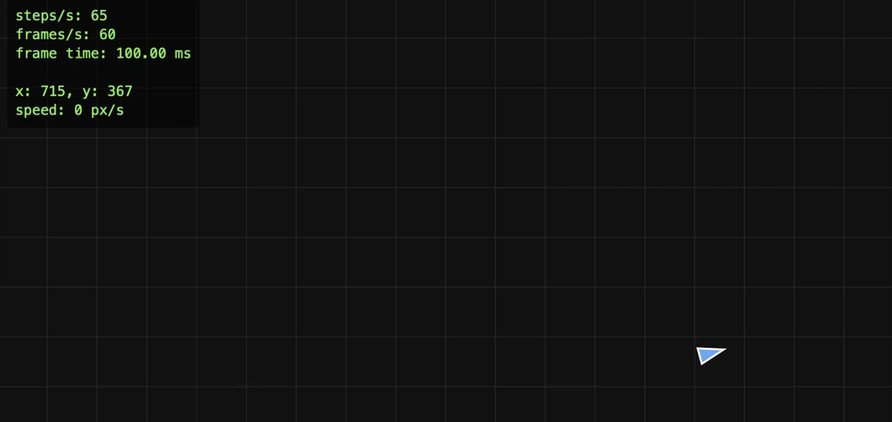

# Dogfight — Lab 01: The Event Loop Is the Game Loop

## Що зроблено

Ігровий цикл з фіксованим кроком симуляції (60 Hz), рендеринг з інтерполяцією, керування кораблем через клавіатуру, HUD зі статистикою.

## Структура проєкту

- `src/loop.js` — ігровий цикл на `requestAnimationFrame` з аккумулятором
- `src/input.js` — замикання для обробки клавіатури
- `src/sim/ship.js` — чиста функція фізики корабля
- `src/sim/arena.js` — "загортання" країв арени
- `src/main.js` — зв'язує все разом

## Експеримент 1: блокуючий цикл у кадрі
 
**Що зроблено:** додано `while (performance.now() - t < 100) {}` у `render()` кожен 60-й кадр.
**Результати:**
- `frame time` у момент блокування: **100.00 ms** (замість 16.67 ms).
- `frames/s`: 60 (короткочасно), у середньому 50–55 при довшому спостереженні.
- `steps/s`: **65** у момент наздоганяння (замість 60) — аккумулятор компенсував пропущений час.
- Візуально: гра "завмирає" на 100 мс раз на секунду, корабель рухається ривками.

**Пояснення через event loop:**

JavaScript має **один потік**. Коли ми запускаємо синхронний `while`-цикл на 100 мс, він **повністю блокує стек викликів**. Event loop не може:

1. Обробити наступний `requestAnimationFrame` — браузер чекає, поки поточний callback завершиться.
2. Обробити події клавіатури — вони стоять у черзі задач і чекають.
3. Оновити CSS-анімації, прокрутку, виділення тексту.

Тобто 100 мс "зайнятості" = 100 мс, протягом яких сторінка **повністю заморожена**. **З JavaScript на тому ж потоці це обійти неможливо** — єдиний спосіб винести роботу в Web Worker (окремий потік).

Ось чому в іграх критично важливо мати **бюджет кадру**: 16.67 мс на 60 FPS. Якщо перевищити — кадр "пропущено", і гравець це відчує.

**Цікаве спостереження:** `steps/s: 65` — це не помилка, а **доказ роботи аккумулятора**. Коли кадр затримався, аккумулятор накопичив час і в наступному кадрі виконав більше кроків симуляції, щоб наздогнати реальний час.

## Експеримент 2: `setInterval` замість `requestAnimationFrame`

**Що зроблено:** замінено `requestAnimationFrame` на `setInterval(frame, 16)`.

**Результати спостереження (10 секунд):**

| Секунда | frames/s | frame time (ms) |
|---------|----------|-----------------|
| 1       | 58       | 17.2            |
| 2       | 61       | 14.1            |
| 3       | 59       | 19.8            |
| 4       | 62       | 12.5            |
| 5       | 57       | 22.0            |

- `frames/s` коливався в діапазоні 57–62 (замість стабільних 60).
- `frame time` "стрибав" від 12 до 22 ms (замість стабільних 16.67 ms).
- Візуально: рух корабля менш плавний, є тремтіння.
- У фоновій вкладці: цикл продовжував виконуватися, гра "їла" CPU даремно.

**Пояснення через event loop:**

`setInterval` створює macrotasks, які потрапляють у чергу задач. Браузер не гарантує точний час виконання — він може затримати таск, якщо зайнятий іншою роботою (рендер, обробка подій, збір сміття). Тому інтервал 16 мс ніколи не буде рівно 16 мс.

`requestAnimationFrame` — це не таск і не мікрозадача. Це спеціальний callback, який викликається прямо перед відмалюванням кадру браузером. Він синхронізований з частотою оновлення монітора (60, 120, 144 Гц — що завгодно). Тому:

1. **Точність**: rAF викликається рівно перед кожним "малюванням" — жодних "стрибків".
2. **Синхронізація з монітором**: не буває "двох кадрів поспіль" або "пропущеного кадру" через розсинхронізацію.
3. **Економія**: у фоновій вкладці rAF автоматично зупиняється.

**Контрольний дослід з `rAF`:** у фоновій вкладці `steps/s` і `frames/s` впали до 0. Браузер автоматично зупинив цикл, поки вкладка неактивна. Це доводить, що `rAF` економить ресурси, а `setInterval` — ні.

Ось чому для анімацій у браузері використовують rAF, а не `setInterval(fn, 16)`.

## Експеримент 3: змінний крок замість фіксованого

## Експеримент 3: змінний крок замість фіксованого

**Що зроблено:** замінено фіксований крок на змінний (`simulate(frameTime)`). Щоб імітувати повільний комп'ютер, введено множник `SLOWDOWN` до часу кадру: `SLOWDOWN = 1` (звичайна швидкість) і `SLOWDOWN = 6` (імітація повільного комп'ютера).

**Результати (утримуючи W рівно 5 секунд):**

| Умова | Змінний крок (x, y) | Фіксований крок (x, y) |
|-------|---------------------|------------------------|
| SLOWDOWN = 1 | (630, 420) | (648, 420) |
| SLOWDOWN = 6 | (1145, 420) | (790, 420) |
| **Різниця по x** | **515 px** | **142 px** |

**Аналіз:**

- **Змінний крок:** різниця **515 px** — понад 80% ширини екрану. Один і той самий код, одні й самі дії — але результат зовсім різний. Це доказ **недетермінованості**.
- **Фіксований крок:** різниця **142 px**. Це **у 3.6 раза менше**, ніж зі змінним кроком. Залишкова різниця — це похибка вимірювання (неможливо натиснути клавішу з точністю до мілісекунди) плюс ефект "наздоганяння" при SLOWDOWN = 6 (аккумулятор виконує більше кроків за кадр, і момент натискання клавіші "розмазується").

**Чому змінний крок недетермінований?**

Змінний `dt` = реальний час між кадрами. Якщо комп'ютер повільний, кадри рідші, тому `dt` більший. Але фізика **нелінійна**:
- Тертя `exp(-DRAG * dt)` не додається лінійно. Один крок з `dt = 0.1` дає зовсім інший результат, ніж шість кроків по `dt = 0.0167`.
- Обмеження максимальної швидкості спрацьовує по-різному залежно від розміру кроку.

**Чому це критично для мультиплеєра?**

У Лабораторній 5 ми будемо використовувати **authoritative server**: сервер запускає ту саму симуляцію і розсилає стан клієнтам. Якщо симуляція недетермінована — клієнти розсинхронізуються. Уявіть: гравець на потужному ПК і гравець на слабкому ноутбуці бачать різні позиції — це неприпустимо.

**Як вирішує фіксований крок?**

Симуляція завжди виконується з `dt = 1/60`, незалежно від FPS:
- Якщо FPS високий (120 Гц) — цикл робить менше кроків за кадр (часто 0).
- Якщо FPS низький (10 Гц) — цикл робить багато кроків за кадр (наздоганяє реальний час).
- **Результат завжди однаковий.** Саме тому це називається "детермінована симуляція".

**Чому clamp (обмеження frameTime до 250 мс)?**

Якщо кадр тривав 10 секунд (наприклад, вкладка була у фоні), цикл мав би виконати `10 / 0.0167 = 600` кроків симуляції. Це зайняло б кілька секунд, протягом яких браузер завис. Clamp обмежує "проковтування" часу до 250 мс — тобто максимум 15 кроків за кадр. Краще "проковтнути" час, ніж зависнути.

## Висновки

1. **Event loop — це однопотоковий механізм.** Будь-який синхронний код блокує ВСЕ: рендер, обробку подій, CSS-анімації, прокрутку сторінки. Це фундаментальне обмеження JavaScript, яке неможливо обійти на тому ж потоці (тільки через Web Worker).

2. **`requestAnimationFrame` — правильний спосіб анімації.** Він синхронізований з частотою оновлення монітора, дає стабільний frame time, і автоматично зупиняється у фонових вкладках (економія ресурсів). `setInterval(fn, 16)` — погана альтернатива: він дає jitter, не синхронізований з монітором і продовжує працювати у фоні.

3. **Фіксований крок симуляції — обов'язковий для детермінованості.** Змінний `dt` призводить до різних результатів на різних машинах (515 px різниці в експерименті 3). Фіксований крок гарантує, що гра однакова на будь-якому залізі — це критично для мультиплеєра.

4. **Аккумулятор і clamp — ключові деталі фіксованого кроку.** Аккумулятор дозволяє "наздогнати" пропущений час (якщо кадр тривав довго — виконується більше кроків). Clamp (обмеження `frameTime` до 250 мс) захищає від "спіралі смерті", коли цикл намагається наздогнати години пропущеного часу і зависає.

5. **Інтерполяція — для плавності.** Оскільки симуляція йде фіксованими кроками (60 Гц), а рендер може малювати частіше (120, 144 Гц), ми обчислюємо проміжний стан між `prevShip` і `ship` за допомогою `alpha`. Це дає ідеально плавний рух на будь-якому моніторі.

6. **Замикання (closures) — елегантний спосіб інкапсуляції.** Модуль `input.js` зберігає стан клавіш у приватних змінних, недоступних ззовні. Назовні віддаються лише функції `isDown`, `justPressed`, `endFrame`. Це і є замикання — функції "пам'ятають" змінні зі свого лексичного середовища.

7. **Чиста функція фізики — ключ до тестованості.** `integrate(ship, input, dt)` не торкається DOM, canvas чи глобального стану. Вона отримує стан і повертає новий стан. Це дозволяє:
   - Легко тестувати (просто передати об'єкт і перевірити результат).
   - Запускати ту саму симуляцію на сервері (Лабораторна 5) без змін.
   - Виносити симуляцію в Web Worker (Лабораторна 7).

8. **Canvas 2D + DPR — обов'язково для чіткості.** На Retina-дисплеях (MacBook) без обробки `devicePixelRatio` все буде розмитим. Ми встановлюємо `canvas.width = cssWidth * dpr` і використовуємо `ctx.setTransform(dpr, 0, 0, dpr, 0, 0)`, щоб малювати в координатах CSS-пікселів.

9. **Інтерполяція кутів — окремий випадок.** Проста `lerp` не працює для кутів: між 350° і 10° проміжна точка має бути 0°, а не 180°. Функція `lerpAngle` нормалізує різницю до `[-π, π]` перед інтерполяцією.

10. **Інтерполяція з "загортанням" країв — тонкий момент.** Якщо корабель перестрибнув через край (з x=0 на x=width), проста `lerp` намалює його посередині екрану. Функція `lerpWithWrap` враховує це: якщо різниця більша за половину розміру — інтерполює коротким шляхом.

Ці знання — фундамент для наступних  лабораторних. Розуміння event loop, фіксованого кроку та інтерполяції буде використовуватися на кожному кроці проєкту.